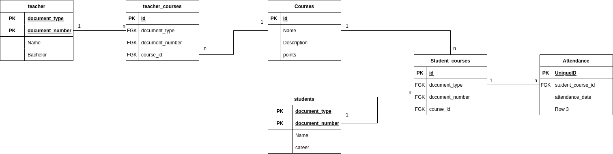

# attendace_list_backend_app

Backend desarrollado en NestJs para gestionar las peticiones del aplicativo de lista de asistencia.

## Problema
!TODO plantear el problema del proyecazure

## Base de datos
!TODO Redacción del planteamiento de la base de datos.

